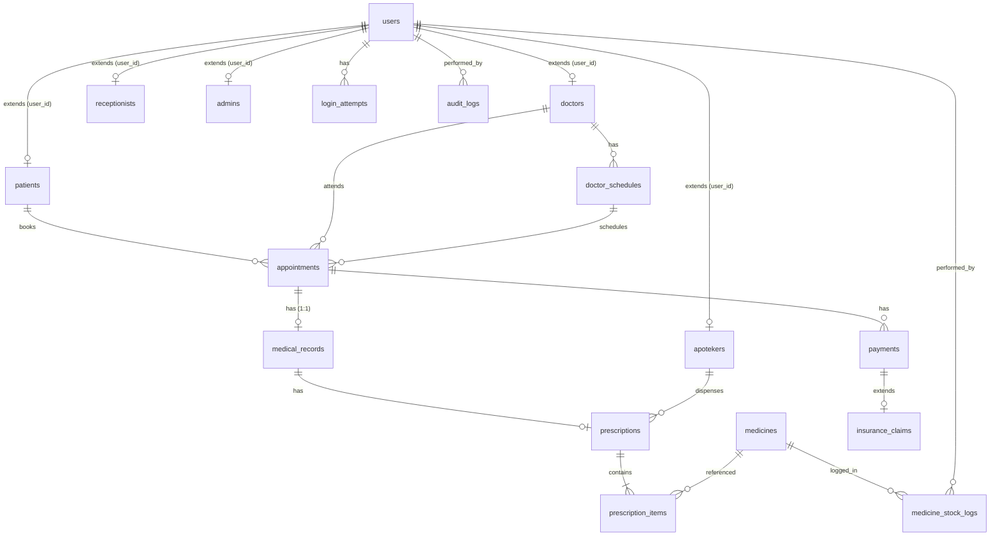

# Data Tier - Sistem Manajemen Klinik dan Apotek

Repositori ini berisi implementasi **Data Tier** (Skema Database, Connection Layer, Base Repository, Seeder Akun Default, dan Konfigurasi Environment) untuk aplikasi klinik.

## Struktur Direktori

```text
/database
  /migrations
    001_create_users_table.php
    002_create_patients_table.php
    ... (satu file per tabel, urut sesuai dependency FK)
  /seeders
    seed_default_accounts.php
  schema_complete.sql (Fallback SQL untuk phpMyAdmin)
/src
  /Config
    Env.php
  /Database
    Connection.php
  /Repository
    BaseRepository.php
    AuditLogRepository.php
    MedicineStockLogRepository.php
  Logger.php
.env
.env.example
.gitignore
config.php
```

---

## Entity-Relationship Diagram (ERD)



---

## Cara Menjalankan Migrasi dan Seeder

### A. Di Lingkungan Development Lokal

1. Salin `.env.example` menjadi `.env` dan sesuaikan kredensial database Anda:
   ```bash
   cp .env.example .env
   ```
2. Jalankan script migrasi CLI untuk membuat database dan tabel:
   ```bash
   php database/migrate.php
   ```
3. Jalankan script seeder untuk membuat akun default per role:
   ```bash
   php database/seeders/seed_default_accounts.php
   ```
4. Kredensial akun default yang dihasilkan akan disimpan di `storage/seeded_credentials.txt` (diabaikan oleh git demi keamanan).

### B. Di Shared Hosting cPanel

Jika Anda tidak memiliki akses SSH di cPanel, ikuti langkah berikut:

1. **Membuat Database & User:** Buat database MySQL dan user baru di panel kontrol cPanel, lalu berikan akses *all privileges* kepada user tersebut.
2. **Konfigurasi .env:** Konfigurasikan file `.env` di atas web root (atau tambahkan proteksi `.htaccess` jika berada di `public_html`).
3. **Impor Skema Database:** Buka phpMyAdmin di cPanel, pilih database Anda, lalu pilih tab **Import** dan upload file `database/schema_complete.sql` untuk membuat seluruh struktur tabel sekaligus.
4. **Menjalankan Seeder / Migrasi Lanjutan:** Jika Anda memiliki akses terminal atau cron job, Anda dapat mengeksekusi script CLI dengan command yang sama seperti di development lokal.
